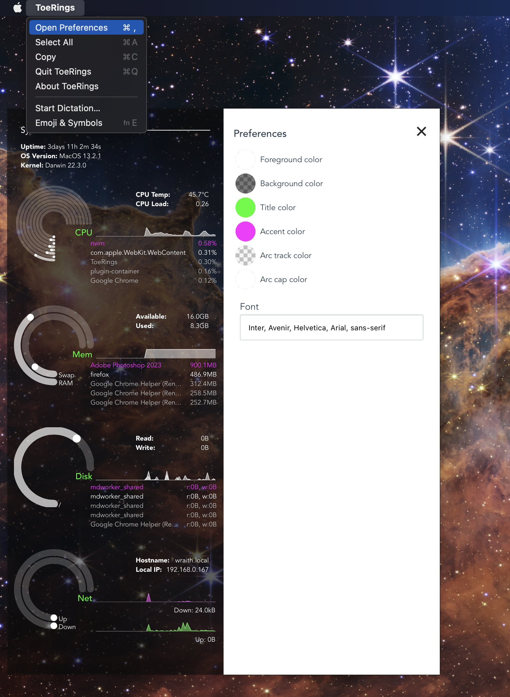

# ToeRings

A theme-able system monitoring tool.


I tried to port the [Seamod](https://github.com/maxiwell/conky-seamod) Conky theme to Tauri.
I copied a lot of the Rust code from [Bottom](https://github.com/ClementTsang/bottom).

The name "ToeRings" just sounds like Tauri, and contains the word "rings".

## Install from Source

You can build the executable locally. Requires you to have NodeJS and Rust installed.

```sh
git clone https://github.com/acarl005/toerings.git
cd toerings
npm i
npm run tauri build
```

## Configure

There is a preferences panel which is accessible from the app menu.



## Run in Development

```sh
npm i
npm run tauri dev
```
